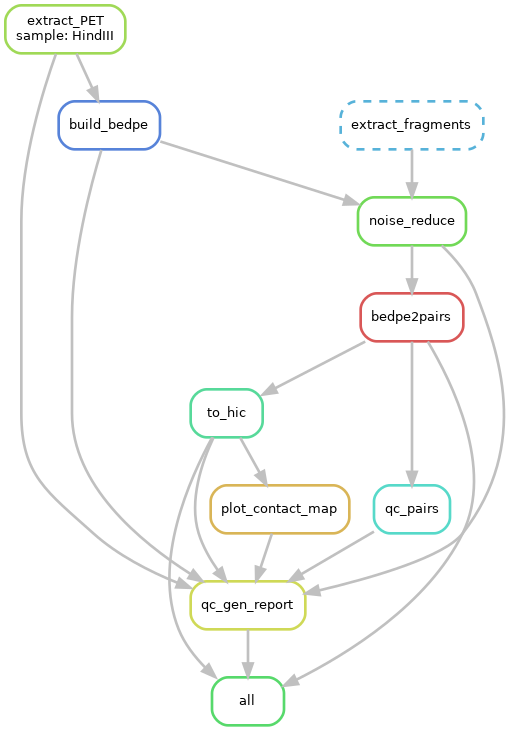

DLO-HiC-Tools
=============

Integrated DLO HiC analyze pipeline.

Installation
------------

This package is only support UNIX-like system.

Recommend install and manage requirements with `conda <https://conda.io/miniconda.html>`_
and `mamba <https://mamba.readthedocs.io/en/latest/user_guide/mamba.html>`_, just use following commands::

    $ git clone https://github.com/Nanguage/DLO-HiC-Tools.git
    $ cd DLO-HiC-Tools/
    $ conda install mamba -c conda-forge  # skip this line if mamba is installed
    $ mamba env create -f environment.yml
    $ conda activate dlo-hic-tools
    $ python setup.py install

Using Docker
^^^^^^^^^^^^

You can also using the docker, pull the dlohic image: ::

    $ docker pull nanguage/dlohic

Run a container, with mount current directory in file system to the '/data' in the container: ::

    $ docker run -v $PWD:/data -ti nanguage/dlohic:latest

Quick Start
-----------

DLO-HiC-Tools is an integrated automatic pipeline for
DLO-HiC data analyze. Before we start, you should install package 
and some dependency. see `installation <#installation>`_.

DLO-HiC-Tools implemented some tools for DLO-HiC data analyze and quality control.
You can list them and get more usage detail by `dlohic` command:

.. code-block::

    $ dlohic --help
    Usage: dlohic [OPTIONS] COMMAND [ARGS]...
    
      DLO HiC Tools command line interface.
    
    Options:
      --log-file TEXT       The log file, default output to stdout.
      --debug / --no-debug  If debug will print all information, default False.
      --version             Show the version and exit.
      --help                Show this message and exit.
    
    Commands:
      PET_span_dist         Count the distribution of PET span.
      bedpe2pairs           Transform BEDPE format file to pairs format,...
      build_bedpe           Build bedpe file from fastq files.
      chr_interactions      Count the interactions between chromosomes.
      extract_PET           Extract the PETs sequences on both sides of...
      extract_fragments     Extract all DNA fragments from fasta file,...
      fragment_length_dist  Draw the distribution figure(kde/box plot),...
      gen_qc_report         Generate pipeline quality control report.
      infer_adapter         Inference adapter sequence, and plot the...
      interactions_qc       Count ratio of: inter-chromosome...
      noise_reduce          Remove noise in DLO-HiC data.
      pipeline              Generate integrated main processes...
      plot_contact_map      Draw the Hi-C contact map.
      remove_redundancy     Remove the redundancy within pairs.

Use the pipeline
^^^^^^^^^^^^^^^^

DLO-HiC-Tools implemented the pipeline with `Snakemake <https://snakemake.readthedocs.io/en/stable/>`_.
If you want generate the HiC matrix and the quality control report(see `example <https://nanguage.github.io/examples/DLO_HiC_Tools/test.html>`_) at once,
you can use this pipeline.

The pipeline contain two files, a Snakemake file and a configuration file.

Firstly, generate them by `dlohic pipeline` command. It will generate the necessary files
under your working directory.

.. code-block::

    $ dlohic pipeline
    dlo_hic.tools.helper.pipeline INFO    @ 08/21/18 21:40:30: Generate config file at ./pipeline_config.ini
    dlo_hic.tools.helper.pipeline INFO    @ 08/21/18 21:40:30: Generate pipeline (Snakemake file) at ./Snakefile
    $ ls
    pipeline_config.ini  Snakefile

Then edit the `pipeline_config.ini` file, just fill the sections with it's comment information.
And you can reference the example data and the configuration file, see `here <https://github.com/Nanguage/DLO-HiC-Tools/tree/master/example/cli>`_.

After all necessary information wrote in to the configuration file, You can run the pipeline.

.. code-block::

    $ snakemake -j 16

The `-j` parameter indicate the number of jobs, it depend on your cpu cores number.
Or, if you use the cluster like pbs system, you can run like this:

.. code-block::

    $ snakemake --cluster qsub -j 16

In addition, you can visualize the pipeline(need `Graphviz <https://www.graphviz.org/>`_ installed):

.. code-block::

    $ snakemake all --dag | dot -Tpng > pipeline.png

More information about the Snakemake, please read it's document.

Visualize the contact map:
^^^^^^^^^^^^^^^^^^^^^^^^^^

The pipeline can generate two kind of result matrix format, `.hic` and `.cool`.
Although there are some contact maps in the HTML report,
but if you want to browse the contact at finer resolution.
You should use the software like:

- `Juicebox <https://github.com/theaidenlab/Juicebox>`_ provided the GUI for `.hic` file.
- `CoolBox <https://github.com/Nanguage/CoolBox>`_ for `.cool` and `.hic` file visualization in the Jupyter nootebook.
